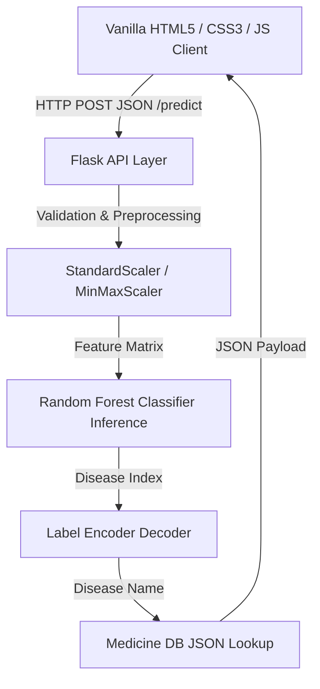

# 🛠️ Technology Stack (TECHSTACK.md)
# MediCare AI — Personalized Healthcare & Medicine Recommendation System

This document outlines the complete technology stack, library dependencies, architectural layers, and data assets that comprise the **MediCare AI** system. It serves as a single source of truth for the technical components used across model training, API backend development, web frontends, and testing environments.

---

## 1. High-Level Architectural Layers

MediCare AI is architected as a lightweight, decoupled **Machine Learning-powered Web Application** consisting of three primary layers:



---

## 2. Core Backend Stack

The backend handles incoming symptom validation, feature scaling, model inference, database lookup, and JSON payload building.

| Component | Technology | Version | Purpose | Link / Reference |
| :--- | :--- | :--- | :--- | :--- |
| **Language Runtime** | Python | 3.10+ (Tested on 3.14.5) | Primary execution environment for Flask server and ML pipelines. | [Python Website](https://www.python.org/) |
| **Web Server Framework** | Flask | 3.1.3 | Lightweight microframework for routing API requests and serving static assets. | [app.py](file:///C:/Users/deepa/Downloads/NEW%20PROJECT/Personalized%20Healthcare%20&%20Medicine%20Recommendation%20System%20%28Data%20ScienceML%20based%29/medicare/medicare/app.py) |
| **CORS Middleware** | Flask-CORS | 6.0.5 | Permits secure cross-origin resource sharing. | [requirements.txt](file:///C:/Users/deepa/Downloads/NEW%20PROJECT/Personalized%20Healthcare%20&%20Medicine%20Recommendation%20System%20%28Data%20ScienceML%20based%29/medicare/medicare/requirements.txt) |
| **Environment Config** | python-dotenv | >=1.0.0 | Loads system-level and port configurations from `.env` files. | [config.py](file:///C:/Users/deepa/Downloads/NEW%20PROJECT/Personalized%20Healthcare%20&%20Medicine%20Recommendation%20System%20%28Data%20ScienceML%20based%29/medicare/medicare/config.py) |
| **Production Server** | Gunicorn | >=22.0.0 | WSGI HTTP Server for production deployments on UNIX/Linux. | [requirements.txt](file:///C:/Users/deepa/Downloads/NEW%20PROJECT/Personalized%20Healthcare%20&%20Medicine%20Recommendation%20System%20%28Data%20ScienceML%20based%29/medicare/medicare/requirements.txt) |

---

## 3. Machine Learning & Data Science Stack

All modeling, scaling, and feature preprocessing computations are built on standard scientific Python libraries.

| Library | Version | Purpose | Files Involved |
| :--- | :--- | :--- | :--- |
| **scikit-learn** | 1.8.0 | Core machine learning library. Implements model training and prediction inference via random forests or classification algorithms. | [best_model.pkl](file:///C:/Users/deepa/Downloads/NEW%20PROJECT/Personalized%20Healthcare%20&%20Medicine%20Recommendation%20System%20%28Data%20ScienceML%20based%29/medicare/medicare/best_model.pkl) |
| **joblib** | 1.5.3 | Handles serialization and deserialization of heavy model artifacts and pipelines. | [app.py](file:///C:/Users/deepa/Downloads/NEW%20PROJECT/Personalized%20Healthcare%20&%20Medicine%20Recommendation%20System%20%28Data%20ScienceML%20based%29/medicare/medicare/app.py) |
| **pandas** | 3.0.3 | High-performance data structure manipulation. Converts input symptoms from API to DataFrames with aligned column ordering. | [Cleaned_Dataset.csv](file:///C:/Users/deepa/Downloads/NEW%20PROJECT/Personalized%20Healthcare%20&%20Medicine%20Recommendation%20System%20%28Data%20ScienceML%20based%29/medicare/medicare/Cleaned_Dataset.csv) |
| **numpy** | 2.4.6 | Low-level mathematical array calculations supporting scikit-learn models. | [requirements.txt](file:///C:/Users/deepa/Downloads/NEW%20PROJECT/Personalized%20Healthcare%20&%20Medicine%20Recommendation%20System%20%28Data%20ScienceML%20based%29/medicare/medicare/requirements.txt) |

### Serialization Artifacts
* **Inference Model:** [best_model.pkl](file:///C:/Users/deepa/Downloads/NEW%20PROJECT/Personalized%20Healthcare%20&%20Medicine%20Recommendation%20System%20%28Data%20ScienceML%20based%29/medicare/medicare/best_model.pkl) — Pre-trained Classifier.
* **Target Label Encoder:** [disease_encoder.pkl](file:///C:/Users/deepa/Downloads/NEW%20PROJECT/Personalized%20Healthcare%20&%20Medicine%20Recommendation%20System%20%28Data%20ScienceML%20based%29/medicare/medicare/disease_encoder.pkl) — Maps numeric predictions back to disease strings (e.g., `3` to `"Hypertension"`).
* **Feature Scaler:** [scaler.pkl](file:///C:/Users/deepa/Downloads/NEW%20PROJECT/Personalized%20Healthcare%20&%20Medicine%20Recommendation%20System%20%28Data%20ScienceML%20based%29/medicare/medicare/scaler.pkl) — Scales raw inputs (e.g., age, BP) using training-derived normalization parameters.

---

## 4. Frontend UI/UX Stack

The user interface uses a polished CSS3 Design System with a modern dark theme, active page tracking, loading state indices, and responsive fluid layout.

* **Layout & Markup:** HTML5 (semantic blocks: `<header>`, `<main>`, `<section>`, `<footer>`).
* **Design System (CSS3):**
  * Modern Google Fonts Integration: `Outfit` (Headings) & `Inter` (Body Text).
  * Design tokens using CSS custom properties (`--primary`, `--bg-dark`, `--text-muted`, etc.).
  * Glassmorphism effects (`backdrop-filter: blur()`).
  * Micro-animations & active indicators on navigation links.
  * Adaptive design using CSS Flexbox & Grid Media Queries.
* **Client-Side Scripts:**
  * Vanilla Javascript (ES6+), avoiding jQuery or complex build stages.
  * Async HTTP communications via `window.fetch()` API.
  * DOM manipulation for interactive cards, progress bars (prediction confidence ranges), and multi-step disease risk level banners.

---

## 5. Storage & Databases

To optimize performance and avoid external query overhead, MediCare AI relies on static datasets and deserialized files:

* **Training Raw Dataset:** [Cleaned_Dataset.csv](file:///C:/Users/deepa/Downloads/NEW%20PROJECT/Personalized%20Healthcare%20&%20Medicine%20Recommendation%20System%20%28Data%20ScienceML%20based%29/medicare/medicare/Cleaned_Dataset.csv) — Stores historical symptoms and diseases.
* **Static Database Store:** [medicine_db.json](file:///C:/Users/deepa/Downloads/NEW%20PROJECT/Personalized%20Healthcare%20&%20Medicine%20Recommendation%20System%20%28Data%20ScienceML%20based%29/medicare/medicare/medicine_db.json) (Legacy pickle store [medicine_database.pkl](file:///C:/Users/deepa/Downloads/NEW%20PROJECT/Personalized%20Healthcare%20&%20Medicine%20Recommendation%20System%20%28Data%20ScienceML%20based%29/medicare/medicare/medicine_database.pkl) is deprecated) — Contains specific mappings of diseases to:
  * Recommended drugs & pharmacological substances.
  * Standard clinical dosage rules.
  * lifestyle advice (exercise, dietary constraints, sleeping guidelines).
  * Direct advice strings.

---

## 6. Testing & Code Quality

* **Test Framework:** pytest (version >= 8.0.0) — Executes unit and integration validation cases.
* **Coverage Tracking:** pytest-cov (version >= 6.0.0) — Measures code line execution coverage (target: >= 80% coverage on [app.py](file:///C:/Users/deepa/Downloads/NEW%20PROJECT/Personalized%20Healthcare%20&%20Medicine%20Recommendation%20System%20%28Data%20ScienceML%20based%29/medicare/medicare/app.py)).
* **Linter & Formatter:** Ruff — For fast code checking, import sorting, and syntax normalization.

---

## 7. Configuration & Environment Variables

System settings are managed via [config.py](file:///C:/Users/deepa/Downloads/NEW%20PROJECT/Personalized%20Healthcare%20&%20Medicine%20Recommendation%20System%20%28Data%20ScienceML%20based%29/medicare/medicare/config.py) and externalized to a local `.env` file (based on [.env.example](file:///C:/Users/deepa/Downloads/NEW%20PROJECT/Personalized%20Healthcare%20&%20Medicine%20Recommendation%20System%20%28Data%20ScienceML%20based%29/medicare/medicare/.env.example)):

```env
PORT=5000
HOST=0.0.0.0
DEBUG=false

MODEL_PATH=./best_model.pkl
ENCODER_PATH=./disease_encoder.pkl
MEDICINE_DB_PATH=./medicine_db.json
SCALER_PATH=./scaler.pkl
```

---

## 8. Complete Project File Directory Map

Click on any file path below to inspect its source code:

### 📄 Root Development Notebooks
* **Primary Model Development:** [Medicine_Recommendation_System.ipynb](file:///C:/Users/deepa/Downloads/NEW%20PROJECT/Medicine_Recommendation_System.ipynb)
* **Alternative Development Notebook:** [Personalized_Medicine_Recommending_System (1).ipynb](file:///C:/Users/deepa/Downloads/NEW%20PROJECT/Personalized_Medicine_Recommending_System%20%281%29.ipynb)

### ⚙️ Backend Core Files
* **Server Entry Point:** [app.py](file:///C:/Users/deepa/Downloads/NEW%20PROJECT/Personalized%20Healthcare%20&%20Medicine%20Recommendation%20System%20%28Data%20ScienceML%20based%29/medicare/medicare/app.py)
* **Configuration Loader:** [config.py](file:///C:/Users/deepa/Downloads/NEW%20PROJECT/Personalized%20Healthcare%20&%20Medicine%20Recommendation%20System%20%28Data%20ScienceML%20based%29/medicare/medicare/config.py)
* **Dependencies list:** [requirements.txt](file:///C:/Users/deepa/Downloads/NEW%20PROJECT/Personalized%20Healthcare%20&%20Medicine%20Recommendation%20System%20%28Data%20ScienceML%20based%29/medicare/medicare/requirements.txt)
* **Model Training Script:** [train_model.py](file:///C:/Users/deepa/Downloads/NEW%20PROJECT/Personalized%20Healthcare%20&%20Medicine%20Recommendation%20System%20%28Data%20ScienceML%20based%29/medicare/medicare/train_model.py)

### 🧪 Automated Test Suite
* **Shared Fixtures:** [conftest.py](file:///C:/Users/deepa/Downloads/NEW%20PROJECT/Personalized%20Healthcare%20&%20Medicine%20Recommendation%20System%20%28Data%20ScienceML%20based%29/medicare/medicare/tests/conftest.py)
* **API Endpoints Integration:** [test_endpoints.py](file:///C:/Users/deepa/Downloads/NEW%20PROJECT/Personalized%20Healthcare%20&%20Medicine%20Recommendation%20System%20%28Data%20ScienceML%20based%29/medicare/medicare/tests/test_endpoints.py)
* **Predict Pipeline Integration:** [test_predict.py](file:///C:/Users/deepa/Downloads/NEW%20PROJECT/Personalized%20Healthcare%20&%20Medicine%20Recommendation%20System%20%28Data%20ScienceML%20based%29/medicare/medicare/tests/test_predict.py)
* **Risk Engine Unit Tests:** [test_risk_level.py](file:///C:/Users/deepa/Downloads/NEW%20PROJECT/Personalized%20Healthcare%20&%20Medicine%20Recommendation%20System%20%28Data%20ScienceML%20based%29/medicare/medicare/tests/test_risk_level.py)
* **Input Validation Unit Tests:** [test_validation.py](file:///C:/Users/deepa/Downloads/NEW%20PROJECT/Personalized%20Healthcare%20&%20Medicine%20Recommendation%20System%20%28Data%20ScienceML%20based%29/medicare/medicare/tests/test_validation.py)

### ⚙️ System Configuration Files
* **Environment variables example:** [.env.example](file:///C:/Users/deepa/Downloads/NEW%20PROJECT/Personalized%20Healthcare%20&%20Medicine%20Recommendation%20System%20%28Data%20ScienceML%20based%29/medicare/medicare/.env.example)
* **Git ignored patterns:** [.gitignore](file:///C:/Users/deepa/Downloads/NEW%20PROJECT/Personalized%20Healthcare%20&%20Medicine%20Recommendation%20System%20%28Data%20ScienceML%20based%29/medicare/medicare/.gitignore)
* **Pytest config:** [pytest.ini](file:///C:/Users/deepa/Downloads/NEW%20PROJECT/Personalized%20Healthcare%20&%20Medicine%20Recommendation%20System%20%28Data%20ScienceML%20based%29/medicare/medicare/pytest.ini)
* **Code coverage config:** [.coveragerc](file:///C:/Users/deepa/Downloads/NEW%20PROJECT/Personalized%20Healthcare%20&%20Medicine%20Recommendation%20System%20%28Data%20ScienceML%20based%29/medicare/medicare/.coveragerc)

### 📊 Data & Schema Files
* **Dataset Schema Docs:** [schema.md](file:///C:/Users/deepa/Downloads/NEW%20PROJECT/Personalized%20Healthcare%20&%20Medicine%20Recommendation%20System%20%28Data%20ScienceML%20based%29/medicare/medicare/data/schema.md)
* **Raw Cleaned Dataset:** [Cleaned_Dataset.csv](file:///C:/Users/deepa/Downloads/NEW%20PROJECT/Personalized%20Healthcare%20&%20Medicine%20Recommendation%20System%20%28Data%20ScienceML%20based%29/medicare/medicare/Cleaned_Dataset.csv)

### 🎨 Frontend Pages & Assets
* **HTML Pages:**
  * [index.html](file:///C:/Users/deepa/Downloads/NEW%20PROJECT/Personalized%20Healthcare%20&%20Medicine%20Recommendation%20System%20%28Data%20ScienceML%20based%29/medicare/medicare/templates/index.html) — Diagnosis dashboard
  * [about.html](file:///C:/Users/deepa/Downloads/NEW%20PROJECT/Personalized%20Healthcare%20&%20Medicine%20Recommendation%20System%20%28Data%20ScienceML%20based%29/medicare/medicare/templates/about.html) — System information
  * [contact.html](file:///C:/Users/deepa/Downloads/NEW%20PROJECT/Personalized%20Healthcare%20&%20Medicine%20Recommendation%20System%20%28Data%20ScienceML%20based%29/medicare/medicare/templates/contact.html) — Support and feedback
* **Assets:**
  * [style.css](file:///C:/Users/deepa/Downloads/NEW%20PROJECT/Personalized%20Healthcare%20&%20Medicine%20Recommendation%20System%20%28Data%20ScienceML%20based%29/medicare/medicare/static/css/style.css) — Custom Design System styles
  * [main.js](file:///C:/Users/deepa/Downloads/NEW%20PROJECT/Personalized%20Healthcare%20&%20Medicine%20Recommendation%20System%20%28Data%20ScienceML%20based%29/medicare/medicare/static/js/main.js) — Async fetch client handler

### 📚 Project Documentations
* **System PRD:** [PRD.md](file:///C:/Users/deepa/Downloads/NEW%20PROJECT/documentations/PRD.md)
* **Architecture Plan:** [ARCHITECTURE_PLAN.md](file:///C:/Users/deepa/Downloads/NEW%20PROJECT/documentations/ARCHITECTURE_PLAN.md)
* **Local Setup Guide:** [README.md](file:///C:/Users/deepa/Downloads/NEW%20PROJECT/documentations/README.md)
* **Development Plans:** [plansdaybyday.md](file:///C:/Users/deepa/Downloads/NEW%20PROJECT/documentations/plansdaybyday.md)
* **Progress Report:** [PROGRESS_AND_STATUS.md](file:///C:/Users/deepa/Downloads/NEW%20PROJECT/documentations/PROGRESS_AND_STATUS.md)

---

## 9. Critical Compliance & Medical Disclaimer

> [!IMPORTANT]
> **MEDICAL ASSESSMENT DISCLAIMER:** MediCare AI is a machine learning implementation intended strictly for demonstrative and educational reference. It does NOT provide professional medical advice, diagnoses, or active treatment recommendations. Users must consult with licensed clinical professionals before making medical decisions.
