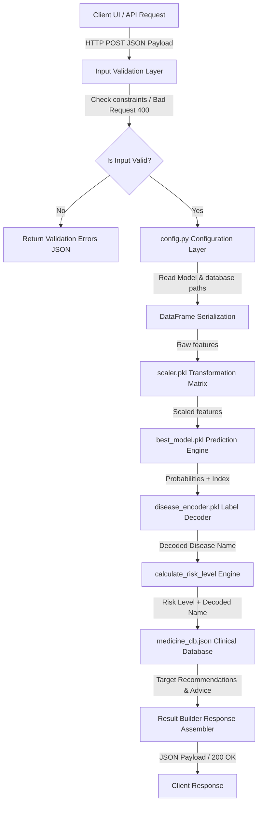

# MediCare AI — Personalized Healthcare & Medicine Recommendation System

[](https://github.com/AradhyaMalaviya/MED-AI/actions/workflows/ci.yml)
[](https://www.python.org/downloads/release/python-3110/)
[](https://htmlpreview.github.io/?https://github.com/AradhyaMalaviya/MED-AI/blob/main/Personalized%20Healthcare%20%26%20Medicine%20Recommendation%20System%20%28Data%20ScienceML%20based%29/medicare/medicare/htmlcov/index.html)
[](https://opensource.org/licenses/MIT)

MediCare AI is an enterprise-grade, machine learning-powered preliminary diagnostic triage system. It accepts demographic profiles and patient symptom arrays, processes them through a mathematically aligned standard scaling pipeline, performs model classification, and couples the prediction with targeted, database-driven medicine recommendations and health advice.

---

## 🏗️ System Architecture & Data Flow

The application executes prediction requests via a strictly decoupled, low-latency pipeline. The end-to-end data flow operates in a single request-response cycle:



### Flow Narrative
1. **Client Request**: The frontend or an API client sends an HTTP `POST` request to `/predict` containing raw demographics and binary symptom flags.
2. **Input Validation**: The request is intercepted by `validate_input()`, verifying type compatibility, structure, and numeric boundaries (e.g., age $0-120$, blood pressure $0-2$).
3. **Configuration Resolve**: `config.py` loads paths to models, scalers, encoders, and database parameters from environment variables (using fallback structures if `.env` is absent).
4. **Serialization & Preprocessing**: Raw values for `age`, `blood_pressure`, and `cholesterol_level` are scaled using the fitted standard scaling transformations in `scaler.pkl` to prevent training-serving skew.
5. **Model Inference**: The scaled features and binary symptom flags are passed to `best_model.pkl` (Random Forest Classifier). Probabilities are extracted and the top 5 predictions are compiled.
6. **Lookup & Response**: The decoded disease name from `disease_encoder.pkl` is used as a lookup key in `medicine_db.json` to append targeted medicines and clinical advice. A structured JSON payload is returned.

---

## 🚀 Quick Start Guide (Local Development)

### 1. Repository Cloning & Directory Navigation
Clone the repository and change directory to the nested application root:
```bash
git clone https://github.com/AradhyaMalaviya/MED-AI.git
cd "MED-AI/Personalized Healthcare & Medicine Recommendation System (Data ScienceML based)/medicare/medicare"
```

### 2. Virtual Environment Configuration
Configure a Python virtual environment and activate it:
```bash
# Create environment
python -m venv venv

# Activate on Windows (PowerShell)
.\venv\Scripts\Activate.ps1

# Activate on Windows (Command Prompt)
venv\Scripts\activate.bat

# Activate on macOS / Linux
source venv/bin/activate
```

### 3. Dependency Installation
Install all runtime and development dependencies pinned in the manifest:
```bash
pip install -r requirements.txt
```

### 4. Environment Variables Initialization
Create a local `.env` file by copying the template:
```bash
copy .env.example .env     # Windows
cp .env.example .env       # macOS/Linux
```

Configure the `.env` settings according to your local environment requirements:
```env
# ---------- Model / Artifact Paths ----------
MODEL_PATH=./best_model.pkl
ENCODER_PATH=./disease_encoder.pkl
MEDICINE_DB_PATH=./medicine_db.json
SCALER_PATH=./scaler.pkl

# ---------- Server Settings ----------
PORT=5000
HOST=0.0.0.0
DEBUG=false

# ---------- Observability ----------
LOG_LEVEL=INFO
ENABLE_METRICS=true
SENTRY_DSN=
SENTRY_ENVIRONMENT=local
```

### 5. Run the Server
Start the local server inside the virtual environment:
```bash
python app.py
```
The server will bind to `http://localhost:5000`. You can verify startup health by running `curl http://localhost:5000/health`.

---

## 🐳 Production Deployment Guide

### Docker Image Compilation
Build the production Docker image using the provided multi-stage `Dockerfile`:
```bash
docker build -t medicare-ai .
```

### Container Invocation
Run the containerized application mapped to port 5000:
```bash
docker run -d -p 5000:5000 --name medicare_service medicare-ai
```

### Production WSGI Topology
The Docker container automatically runs the app under a Gunicorn WSGI server using the following production configuration:
* **Workers**: 2 (Multi-worker topology to handle concurrent requests)
* **Threads**: 2 (Thread pools for async processing)
* **Timeout**: 60 seconds
* **Access & Error Logs**: Logged directly to `/dev/stdout` and `/dev/stderr` for container runtime monitoring.

### Orchestration Local Deployment
Deploy the full container stack (including operational healthchecks) using Docker Compose:
```bash
docker compose up -d --build
```
To bring the service down, run `docker compose down`.

---

## 🧪 Contributing & Development Workflows

To maintain maximum code quality and security, run linting and testing checks before submitting pull requests.

### Linting & Formatting Check (Ruff)
Run static analysis to enforce coding style and lint rules:
```bash
python -m ruff check .
```

### Running the Test Suite & Coverage Gate
Execute the unit and integration tests and verify that the line coverage meets the strictly enforced quality gate threshold ($\ge 80\%$):
```bash
# Run pytest with coverage checks
python -m pytest --cov-fail-under=80

# Generate full HTML coverage report
python -m pytest --cov=. --cov-report=html
```
The coverage results can be viewed locally by opening the generated `htmlcov/index.html` report.

---

## ⚖️ License
Distributed under the MIT License. See `LICENSE` for details.
