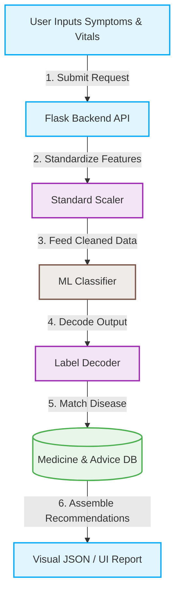

# ⚕️ MediCare AI — Personalized Healthcare & Medicine Recommendation System

*An intelligent, patient-first assistant powered by machine learning that guides you from symptoms to solutions.*

[](https://github.com/AradhyaMalaviya/MED-AI/actions/workflows/ci.yml)
[](https://www.python.org/downloads/release/python-3110/)
[](https://htmlpreview.github.io/?https://github.com/AradhyaMalaviya/MED-AI/blob/main/Personalized%20Healthcare%20%26%20Medicine%20Recommendation%20System%20%28Data%20ScienceML%20based%29/medicare/medicare/htmlcov/index.html)
[](https://opensource.org/licenses/MIT)

---

## 🌟 What is MediCare AI?

**MediCare AI** is a modern, web-based preliminary diagnostic companion designed to bridge the gap between symptoms and care. By inputting demographic details and select symptoms, users receive an instant, AI-guided assessment detailing potential health conditions, risk levels, recommended medicines, and actionable lifestyle advice. 

Whether you are a developer exploring medical ML systems, or just curious about how AI can support health triage, MediCare AI offers an intuitive experience with a stunning modern interface.

> [!NOTE]  
> **A Friendly Note:** MediCare AI is designed as a preliminary advisory tool. It does *not* replace a professional consultation. In a medical emergency, please contact healthcare professionals immediately. 🚑

---

## ✨ Features at a Glance

* **🔬 Smart Predictor Engine**: Uses machine learning to evaluate symptom combinations and patient vitals.
* **📊 Top Differential Diagnoses**: Displays the primary suspected disease alongside 4 other potential alternatives with confidence percentages.
* **💊 Medicine Recommendation Guide**: Instantly pulls recommended dosages, schedules, and precautions from our clinical database.
* **🥗 Actionable Lifestyle Advice**: Offers structured recommendations on dietary adjustments, exercise, and habits.
* **🎨 Modern Responsive Interface**: Featuring an elegant glassmorphism design, interactive symptom cards, and smooth micro-animations.

---

## 🗺️ How It Works (Data Flow)

MediCare AI works through a simple, low-latency analysis cycle. Here is what happens behind the scenes:



1. **Your Input**: Enter age, vitals (blood pressure, cholesterol), and common symptoms.
2. **Precision Preprocessing**: Numeric features are scaled to prevent training bias.
3. **ML Classification**: The pre-trained Random Forest model analyzes patterns to make predictions.
4. **Knowledge Retrieval**: The decoded disease maps to `medicine_db.json` for specific treatment insights.
5. **Clear Output**: Recommendations and risk ratings are formatted in a clean, human-readable layout.

---

## 🚀 Quick Start Guide

Ready to get MediCare AI running locally? Let's get started in just a few steps!

### 1. Grab the Code & Navigate
Clone the repository and move to the application directory:
```bash
git clone https://github.com/AradhyaMalaviya/MED-AI.git
cd "Personalized Healthcare & Medicine Recommendation System (Data ScienceML based)/medicare/medicare"
```

### 2. Set Up Your Environment
Create a clean virtual environment and activate it:
```bash
# Create
python -m venv venv

# Activate (Windows PowerShell)
.\venv\Scripts\Activate.ps1

# Activate (Windows CMD)
venv\Scripts\activate.bat

# Activate (macOS / Linux)
source venv/bin/activate
```

### 3. Install Dependencies
```bash
pip install -r requirements.txt
```

### 4. Initialize Settings
Create your configuration file from the template:
```bash
# Windows
copy .env.example .env

# macOS / Linux
cp .env.example .env
```

### 5. Launch and Explore!
Start the server:
```bash
python app.py
```
Open **[http://localhost:5000](http://localhost:5000)** in your browser and run your first diagnosis! 🎉

---

## 🐳 Running with Docker

Prefer containerized deployments? We've got you covered.

### Single Container
Build and start the application instantly:
```bash
# Build
docker build -t medicare-ai .

# Run
docker run -d -p 5000:5000 --name medicare_service medicare-ai
```

### Multi-Container Setup (Docker Compose)
Deploy the service with built-in healthchecks:
```bash
docker compose up -d --build
```

---

## 🧪 Testing & Code Quality

We maintain high standards of code coverage and styling.

* **Linting & Code Formatting**: Enforced via Ruff.
  ```bash
  python -m ruff check .
  ```
* **Run Tests**: Powered by PyTest. Make sure tests pass before contributing!
  ```bash
  python -m pytest --cov-fail-under=80
  ```

---

## ⚖️ License & Disclaimer

* **License**: Distributed under the MIT License. See `LICENSE` for details.
* **Disclaimer**: This tool is for informational/educational purposes only. The recommendations provided do not constitute professional medical advice, diagnosis, or treatment. Always consult a healthcare provider for medical concerns.
