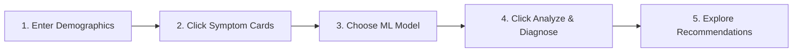

# 🏥 MediCare AI — Companion Setup & Reference Guide

*Welcome to the developer companion guide! Here, you'll find everything you need to set up, understand, and customize your MediCare AI instance.*

---

## 📋 Table of Contents

- [⚙️ System Requirements](#-system-requirements)
- [📦 Quick Installation](#-quick-installation)
- [🔧 Configuration & Environment](#-configuration--environment)
- [🖥️ Step-by-Step Launch Guide](#️-step-by-step-launch-guide)
- [✨ Walking Through the Web UI](#-walking-through-the-web-ui)
- [🔌 API Reference (For Developers)](#-api-reference-for-developers)
- [🧪 Testing Your Changes](#-testing-your-changes)
- [📁 Understanding the Project Structure](#-understanding-the-project-structure)
- [🔍 Troubleshooting Common Hurdles](#-troubleshooting-common-hurdles)

---

## ⚙️ System Requirements

Before getting started, make sure you have the basics ready on your computer:

| Component | Minimum Version | How to Check |
| :--- | :--- | :--- |
| **Python** | 3.10+ | `python --version` |
| **pip** | 22.0+ | `pip --version` |
| **Git** *(Optional)* | Any | `git --version` |

> [!NOTE]
> This application has been thoroughly tested on **Python 3.11** and above. If you run into issues, verifying your Python version is a great first step!

---

## 📦 Quick Installation

Let's walk through downloading and prepping your local workspace.

### Step 1: Locate the Application Root
If you've cloned the workspace, open your terminal and navigate to the application folder (this is where `app.py` lives):

```bash
cd "Personalized Healthcare & Medicine Recommendation System (Data ScienceML based)/medicare/medicare"
```

> [!IMPORTANT]
> Always execute the commands in this guide from the folder containing `app.py`. Otherwise, Python won't be able to locate the pre-trained machine learning models!

### Step 2: Set Up a Virtual Space
A virtual environment keeps your project dependencies isolated and clean.

* **Windows (PowerShell):**
  ```powershell
  python -m venv venv
  .\venv\Scripts\Activate.ps1
  ```
* **Windows (CMD):**
  ```cmd
  python -m venv venv
  venv\Scripts\activate.bat
  ```
* **macOS / Linux:**
  ```bash
  python3 -m venv venv
  source venv/bin/activate
  ```

*You'll know it worked when you see `(venv)` appear at the start of your command prompt!*

### Step 3: Install Dependencies
With your virtual environment active, run:
```bash
pip install -r requirements.txt
```

---

## 🔧 Configuration & Environment

The app runs with sensible defaults automatically, but you can customize ports, debug modes, and folder paths easily.

1. **Create your configuration file:**
   ```bash
   # On Windows
   copy .env.example .env
   
   # On macOS/Linux
   cp .env.example .env
   ```
2. **Open `.env` in a text editor to view or edit the settings:**

```env
# --- Server Settings ---
PORT=5000          # The port number you want to use (default is 5000)
HOST=0.0.0.0      # Set to 127.0.0.1 for private local-only access
DEBUG=false        # Turn on 'true' to auto-restart the app when code changes

# --- Model & Data Paths ---
# MODEL_PATH=./best_model.pkl
# ENCODER_PATH=./disease_encoder.pkl
# MEDICINE_DB_PATH=./medicine_db.json
# SCALER_PATH=./scaler.pkl
```

---

## 🖥️ Step-by-Step Launch Guide

Let's bring MediCare AI to life!

### 1. Launch the Server
In your activated terminal, run:
```bash
python app.py
```

### 2. Verify Startup Logs
You should see beautiful startup logs confirming that your models and databases loaded successfully:
```text
2026-06-17 19:59:54 [INFO] medicare: Loading models...
2026-06-17 19:59:54 [INFO] medicare: Best model loaded from ./best_model.pkl
2026-06-17 19:59:54 [INFO] medicare: Label encoder loaded from ./disease_encoder.pkl
2026-06-17 19:59:54 [INFO] medicare: Scaler loaded from ./scaler.pkl
2026-06-17 19:59:54 [INFO] medicare: Medicine database loaded from ./medicine_db.json
2026-06-17 19:59:54 [INFO] medicare: Backend ready!
```

### 3. Open in Browser
Now, open your favorite browser and visit:
👉 **[http://localhost:5000](http://localhost:5000)**

### 4. Health Check Command
You can also run a quick check via terminal to confirm the API is responsive:
```bash
curl http://localhost:5000/health
```
**Expected response:**
```json
{
  "status": "healthy",
  "model_loaded": true,
  "encoder_loaded": true,
  "message": "Backend is running!"
}
```

---

## ✨ Walking Through the Web UI

Ready to diagnose your first patient? Here is how to use the interactive dashboard:



1. **Fill Out Vitals**: Input patient age, gender, blood pressure, and cholesterol levels.
2. **Select Symptoms**: Toggle cards representing indicators like `Fever`, `Cough`, `Fatigue`, or `Difficulty Breathing`.
3. **Choose Model**: Select the predictor model (Random Forest is default and highly recommended).
4. **Analyze**: Click the blue action button.
5. **Read Insights**: The results tab displays:
   * **Suspended Disease**: Name and primary risk category.
   * **Differential Diagnoses**: Visual bar charts of alternatives.
   * **Treatment Guide**: Suggested over-the-counter medicines and lifestyle tips.

---

## 🔌 API Reference (For Developers)

Integrating MediCare AI into another app? Here are the endpoints:

### `POST /predict`
Submits demographic data and symptom markers to run diagnostic predictions.

* **Request Body Schema:**
```json
{
  "age": 45,
  "gender": 1,
  "fever": 1,
  "cough": 1,
  "fatigue": 0,
  "breathing": 0,
  "bloodPressure": 1,
  "cholesterol": 1,
  "model": "rf"
}
```

* **Parameter Details:**
  * `gender`: `0` for Female, `1` for Male.
  * `bloodPressure` / `cholesterol`: `0` = Low, `1` = Normal, `2` = High.
  * `model`: `"rf"` (Random Forest), `"gb"` (Gradient Boosting), `"lr"` (Logistic Regression).

* **Example Success Response:**
```json
{
  "success": true,
  "disease": "Hypertension",
  "confidence": 87.23,
  "risk": "medium",
  "top5": [
    { "disease": "Hypertension", "confidence": 87.23 },
    { "disease": "Diabetes", "confidence": 6.11 }
  ],
  "medicines": ["💊 Lisinopril 10mg - Once daily morning"],
  "advice": ["🧂 DIET: Drastically limit salt intake"],
  "model_used": "rf",
  "timestamp": "2026-06-17T20:00:00"
}
```

### `GET /health`
Returns validation check of loaded models and backend availability.

### `GET /models`
Lists available model engines and the categories of diseases they can predict.

---

## 🧪 Testing Your Changes

Before making commits or proposing pull requests, run our validation suite:

```bash
# Run tests
pytest

# View coverage percentage
pytest --cov=app --cov-report=term-missing
```

We aim to keep our code coverage **above 80%** to ensure stability and accuracy!

---

## 📁 Understanding the Project Structure

Here is a map of the source files to help you locate what you need:

```text
medicare/medicare/
├── app.py                  # Main Flask backend & ML pipeline endpoints
├── config.py               # Application settings and env-variable loading
├── train_model.py          # Model trainer/retrainer script
├── requirements.txt        # Runtime python dependencies
│
├── best_model.pkl          # Trained Random Forest classifier
├── scaler.pkl              # Normalizer matrix for patient age and vitals
├── disease_encoder.pkl     # Maps internal prediction labels to disease names
├── medicine_db.json        # Treatment recommendations database
├── Cleaned_Dataset.csv     # Dataset used to train the ML models
│
├── static/                 # Styles, scripts, and media
│   ├── css/style.css       # Custom Glassmorphism UI tokens
│   └── js/main.js          # Interactive frontend client logic
│
├── templates/              # Visual user interface layouts
│   ├── index.html          # Main triage dashboard
│   ├── about.html          # Details about the project background
│   └── contact.html        # Support & details pages
│
└── tests/                  # Integrity verification suite
    ├── conftest.py         # Mock server and client fixtures
    └── test_predict.py     # End-to-end diagnosis verification tests
```

---

## 🔍 Troubleshooting Common Hurdles

### ❌ `ModuleNotFoundError: No module named 'flask'`
* **Why it happens**: Your virtual environment is not activated, or packages were installed globally.
* **How to fix**: Run `.\venv\Scripts\Activate.ps1` (Windows PowerShell) or `source venv/bin/activate` (macOS/Linux) and then run `pip install -r requirements.txt`.

### ❌ `Failed to load best_model.pkl`
* **Why it happens**: Python cannot find the model files in the current running directory.
* **How to fix**: Ensure you are launching the command `python app.py` from within the directory that contains the files `best_model.pkl` and `app.py`.

### ⚠️ `InconsistentVersionWarning`
* **Why it happens**: The model was saved with a different version of scikit-learn than the one installed.
* **How to fix**: This is only a warning! The app handles it smoothly under the hood. If you'd like to get rid of the message entirely, run `python train_model.py` to retrain the models with your current packages.

### ❌ Port 5000 is Already in Use
* **Why it happens**: Another app (often AirPlay on macOS, or a Docker container) is using port 5000.
* **How to fix**: You can run the app on a custom port by editing your `.env` file and changing `PORT=5000` to `PORT=8080`, or setting it directly in your terminal prior to running the app:
  * PowerShell: `$env:PORT=8080`
  * Command Prompt: `set PORT=8080`
  * Linux/macOS: `export PORT=8080`

---

<p align="center">
  <strong>⚕️ MediCare AI Team</strong><br>
  <sub>Providing guidance on symptoms, but please consult a professional doctor in case of actual sickness.</sub>
</p>
